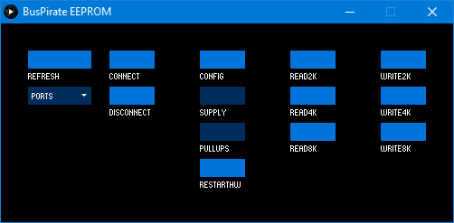

# BusPirate EEPROM/EDID R/W 
A simple [Processing](https://processing.org/) sketch to read/write 24C0x(or compatible) EEPROMs using a [BusPirate](http://dangerousprototypes.com/docs/Bus_Pirate)  
Uses [ControlP5](http://www.sojamo.de/libraries/controlP5/) library for GUI.
### Usage
1. Change *BAUD* in Busp_EEP.ino file according to your board baud rate
2. Select serial port from the list and connect
3. Press *Config* to put BP into binary I2C mode
4. Depending on your setup, enable BP supply and pullups
5. Read/write the data, *2k/4k/8k* is the size in bits
* Check console after every command for status and results  
  
